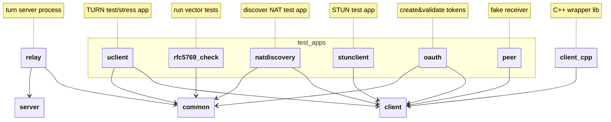

## Developer

### Modules

The coturn repository includes different applications and libraries.   The next diagram represents those modules and their dependencies:

### Flow chart

### Edit flow chart
- Use [drawio](https://app.diagrams.net/) to edit.

1. Open [drawio](https://app.diagrams.net/) in brower
2. Menu → File → Open from ... → Device:

   Select [FlowChart.html](drawio/FlowChart.html)

3. Edit flow chart
4. Export to svg:

   Menu → File → Export as... → SVG...

